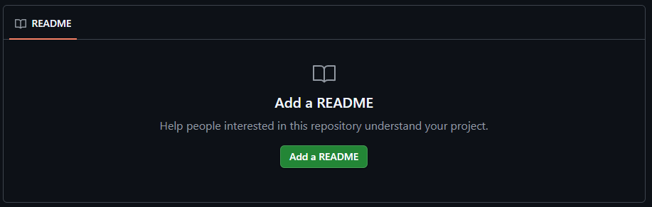

# 🎬 心情视频 · Mood Video

> **以 AI 数字伴侣「小暖」为核心的银发生活守护平台**  
> 不只是工具，更是老人身边的数字老伴 + 防骗保镖

---



---

## 📱 一句话介绍

专为老年人设计的 AI 短视频社交 APP——输入一句话、拍一张照片、说一段语音，30 秒生成专属的个性化心情短视频；同时融合 **AI 数字伴侣**、**健康守护**、**GPS 防走失**、**老友社交**、**AI 反诈防护** 五大模块，让独居老人不孤单、让子女更安心。

---

## ✨ 五大核心模块

| 模块 | 功能 | 对老人的价值 | 对子女的价值 |
|------|------|-------------|------------|
| 🎬 **AI 心情视频** | 一句话/照片/语音 → 30秒生成精美短视频 | 不会打字也能用，体面地分享生活 | 每天看到父母的生活状态 |
| 🤖 **AI 数字伴侣小暖** | 24h 语音陪聊 + 主动关怀 + 代办提醒 | 随时有人说话，不再孤独 | 小暖每日自动推送状态报告 |
| ❤️ **健康守护** | 心情/血压/用药/步数/睡眠/血糖 打卡 | 养成健康习惯，生成健康日记 | 异常数据实时告警（漏药/血压异常） |
| 📍 **GPS 防走失** | 实时定位 + 电子围栏 + SOS 一键求助 | 外出安心，迷路有救援 | 超出安全区域立即推送告警 |
| 🛡️ **AI 反诈防护** | 来电识别 + 短信扫描 + 关键词拦截 + 案例教学 | 守住养老钱，不被骗 | 反诈事件实时同步，远程协助 |

---

## 🔄 版本演进

| 版本 | 代号 | 核心升级 |
|------|------|---------|
| **V1** | 基础版 | 一句话/照片/语音 → AI 生成心情视频，分享家人圈 |
| **V2** | 温暖版 | 全新暖色 UI（暖杏/奶咖/木质棕），健康打卡，家人圈→**老友圈** |
| **V3** | 安全版 | 健康数据同步子女 + **GPS 实时定位 + 电子围栏 + SOS** |
| **V4** | 陪伴版 | **AI 数字伴侣「小暖」** — 24h 陪聊、主动关怀、每日状态报告 |
| **V5** | 守护版 | **六层反诈防护** — 来电识别、短信扫描、关键词拦截、案例教学、紧急告警、子女看板 |

---

## 🎨 交互原型在线预览

点击下方链接即可在浏览器中直接体验可交互的 App 原型（双端：老人端 + 子女端）：

👉 **[🚀 点击体验 V5 反诈防护版原型](https://foxblue99.github.io/mood-video/mood-video-prototypes/V5_%E5%8F%8D%E8%AF%88%E9%98%B2%E6%8A%A4%E7%89%88.html)**

👉 **[V4 AI 陪伴版](https://foxblue99.github.io/mood-video/mood-video-prototypes/V4_AI%E9%99%AA%E4%BC%B4%E7%89%88.html)**  
👉 **[V3 健康同步+GPS 定位版](https://foxblue99.github.io/mood-video/mood-video-prototypes/V3_%E5%81%A5%E5%BA%B7%E5%90%8C%E6%AD%A5_GPS%E5%AE%9A%E4%BD%8D%E7%89%88.html)**  
👉 **[V2 温暖版](https://foxblue99.github.io/mood-video/mood-video-prototypes/V2_%E6%B8%A9%E6%9A%96%E7%89%88APP%E5%8E%9F%E5%9E%8B.html)**  
👉 **[V1 基础版](https://foxblue99.github.io/mood-video/mood-video-prototypes/APP%E5%8E%9F%E5%9E%8B%E4%BA%A4%E4%BA%92%E6%BC%94%E7%A4%BA.html)**

> 💡 **原型使用提示**：原型在桌面浏览器中打开，在左右两部手机中展示了老人端（左侧）和子女端（右侧），所有按钮和导航均可点击交互。

---

## 📋 产品文档

- [📘 产品规划方案 v5.0](心情视频APP/产品规划方案.md) — 定位、功能设计、UI/UX、技术架构、合规策略
- [📗 工程实施计划](心情视频APP/工程实施计划_从原型到上线.md) — 从原型到上线的 5 阶段路线图、团队配置、成本估算
- [📕 合作伙伴招募方案](心情视频APP/合作伙伴招募方案.md) — 四类目标对象、触达渠道、操作路径

---

## 🛠 技术架构（规划）

| 层 | 技术选型 | 说明 |
|----|---------|------|
| **移动端** | Flutter / React Native | 一套代码双端（iOS + Android） |
| **后端** | NestJS / Go + PostgreSQL | 高并发 API 服务，强类型安全 |
| **AI 能力** | 通义千问 / 讯飞星火 / 字节即梦 / 可灵 | 多模型策略，最优性价比路由 |
| **实时通信** | WebSocket + 极光推送 | 健康告警、位置告警、反诈告警实时送达 |
| **地图定位** | 腾讯地图 SDK | 国内定位精准，合规合规 |
| **云基础设施** | 腾讯云 | 服务器、数据库、对象存储、CDN |
| **CI/CD** | GitHub Actions | 自动化测试、构建、发布 |

---

## 🗓 里程碑规划

```
P1 地基（1-2月）      → 环境搭建、数据库设计、CI/CD 就绪
P2 MVP（3-5月）       → 打通 AI 视频生成全链路，核心 4 页面跑通
P3 双端+合规（6-7月） → 子女端、健康同步、GPS、反诈、算法备案
P4 上线冲刺（8月）     → 应用商店提交、4 周灰度发布
P5 迭代（9月+）       → 老友圈、B 端养老院版、付费体系
```

---

## 🤝 寻找合作伙伴

本项目目前处于**原型验证完成、寻求开发伙伴**阶段。我们拥有：

- ✅ 完整的产品规划与交互原型（V1-V5 五个版本迭代）
- ✅ 详尽的工程实施计划与成本模型
- ✅ 233 个 AI 专家组成的 Autonomous Optimization 技术团队
- 🔄 **正在寻找**：移动端开发合伙人、养老机构合作方、早期投资人

如果你关注**银发经济**、**AI 陪伴**、**养老科技**领域，欢迎联系！

---

## 📬 联系与合作

- 📧 **邮箱**：请通过 GitHub Issues 留言
- 💬 **讨论**：[GitHub Discussions](https://github.com/foxblue99/mood-video/discussions)
- 🐛 **问题反馈**：[GitHub Issues](https://github.com/foxblue99/mood-video/issues)

---

## 📄 开源协议

本项目采用 **MIT 协议**开源。原型和文档可自由使用，欢迎 Fork 参与共建。

---

> *让科技有温度，让陪伴零距离。*  
> *给爸妈的不只是一个 App，更是一个不会离开的老伴。*

